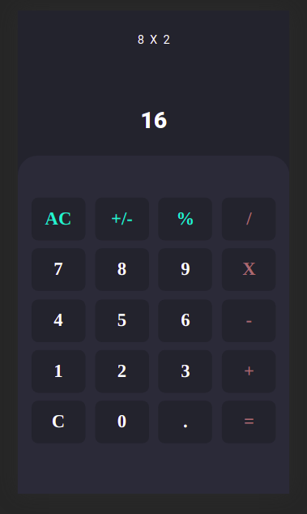

<h1 align="center">Welcome to calculator 👋</h1>
<p>
  <a href="https://www.npmjs.com/package/calculator" target="_blank">
    
  </a>
  <a href="https://mit-license.org/" target="_blank">
    
  </a>
</p>

> Calculadora



## Install

```sh
yarn install
```

## Usage

```sh
yarn run web
```

## Author

👤 **Wellici Araujo**

- Website: https://github.com/wdev007
- Twitter: [@wdev007](https://twitter.com/wdev007)
- Github: [@wdev007](https://github.com/wdev007)
- LinkedIn: [@Wellici Araújo](https://linkedin.com/in/Wellici Araújo)

## Show your support

Give a ⭐️ if this project helped you!

## 📝 License

Copyright © 2021 [Wellici Araujo](https://github.com/wdev007).<br />
This project is [MIT](https://mit-license.org/) licensed.

---

_This README was generated with ❤️ by [readme-md-generator](https://github.com/kefranabg/readme-md-generator)_
